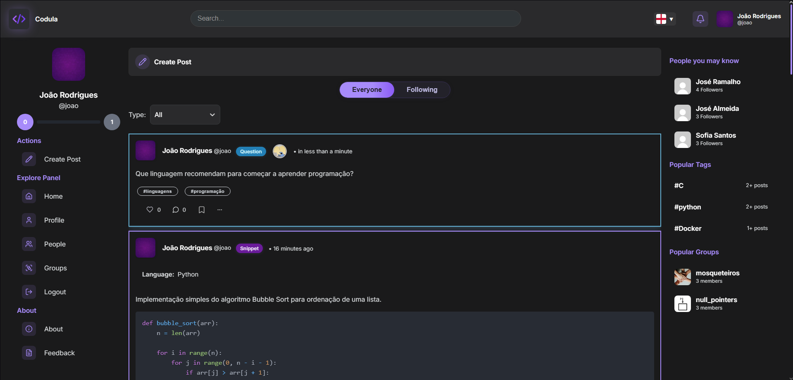

# Codula – Programming Education Social Network

Codula is an educational social network developed as part of a Master’s dissertation in Computer Engineering at the University of Minho.  
The platform aims to support programming education, especially for beginners, by combining social interaction, knowledge sharing, and basic gamification elements.

## Home Screen



## Features

- Creation posts with different types (code snippets, tutorials, memes, research, questions)  
- Comments, likes, and notifications  
- User profiles and groups  
- Basic gamification to encourage user participation  

## Architecture

- Web Frontend (SPA) built with **React**
- Microservices-based Backend built with **FastAPI**
- PostgreSQL database
- Nginx
- Docker & Docker Compose

## Running the Project

### Requirements
- Docker

### Start the application
```bash
docker-compose up --build
```

The application will be available at:
```
http://localhost:3000
```

## Online Version

The online version is available at:
https://codula.epl.di.uminho.pt